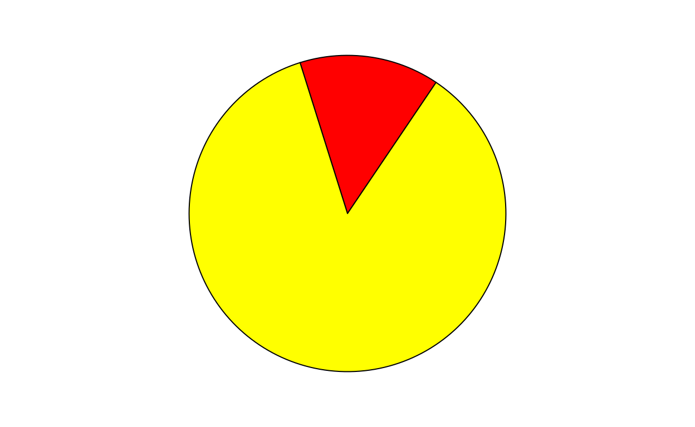

# Introduction

- This is an **R Markdown** document [@R-rmarkdown].
- Markdown is a simple formatting syntax for authoring HTML, PDF, and MS Word documents, etc.
- For more details on using R Markdown, see <https://rmarkdown.rstudio.com>.

# R Markdown

## Embed R code

### Data

You can embed an R code chunk like this:


```r
dat <- iris[, 1:2]
names(dat) <- c('x', 'y')
str(dat)
```

```
## 'data.frame':	150 obs. of  2 variables:
##  $ x: num  5.1 4.9 4.7 4.6 5 5.4 4.6 5 4.4 4.9 ...
##  $ y: num  3.5 3 3.2 3.1 3.6 3.9 3.4 3.4 2.9 3.1 ...
```

## Draw plots

### Starry night


```r
par(mar = c(4, 4, .1, .2))
smoothScatter(dat)
sunflowerplot(dat, pch = 20, col = 7, seg.col = 7, size = .1, add = TRUE)
```


## Create tables

### A simple table


```r
fit <- lm(y ~ x, data = dat)
tab <- coef(summary(fit))  # regression coefficients
knitr::kable(tab, caption = 'A simple table.')
```


Table: A simple table.

               Estimate   Std. Error   t value   Pr(>|t|)
------------  ---------  -----------  --------  ---------
(Intercept)       3.419        0.254     13.48      0.000
x                -0.062        0.043     -1.44      0.152

## Inline code

### The model

The fitted model is: $$Y = 3.419 + -0.062X$$ 

# Other features

## Figure caption

You can also add captions and numbers to figures. See Figure \@ref(fig:pie) for example.

<div class="tutorial-exercise" data-label="pie" data-caption="Code" data-completion="1" data-diagnostics="1" data-startover="1" data-lines="0">

```text
par(mar = c(0, 1, 0, 1))
pie(
  c(280, 60, 20),
  c('Sky', 'Sunny side of pyramid', 'Shady side of pyramid'),
  col = c('#0292D8', '#F7EA39', '#C4B632'),
  init.angle = -50, border = NA
)
```

<script type="application/json" data-opts-chunk="1">{"fig.width":6.5,"fig.height":4,"fig.retina":2,"fig.align":"default","fig.keep":"high","fig.show":"asis","fig.cap":"My favorite pie chart.","out.width":624,"warning":true,"error":false,"message":true,"exercise.df_print":"paged","exercise.checker":"NULL"}</script></div>

## Dynamic content

### Animation


```r
par(mar = c(0, 1, 0, 1))
a = sample(0:359, 1)
for (i in 1:2) {
  pie(c(i %% 2, 6), col = c('red', 'yellow'), labels = NA,
      init.angle = a)
}
```




### Leaflet maps


```r
library(leaflet)
leaflet() %>% addTiles() %>% setView(-122.410951, 37.7858188, zoom = 19)
```

preservefde1786edd01996a

### DataTables


```r
DT::datatable(iris)
```

preserve25b8eafe858602be


preservef08f3cfff50f8d46
preserve3f39d3ca214c4a6e
preserve52d4ab7c05ad0cc2
<!--html_preserve-->
<script type="application/shiny-prerendered" data-context="dependencies">
{"type":"list","attributes":{},"value":[{"type":"list","attributes":{"names":{"type":"character","attributes":{},"value":["name","version","src","meta","script","stylesheet","head","attachment","package","all_files","pkgVersion"]},"class":{"type":"character","attributes":{},"value":["html_dependency"]}},"value":[{"type":"character","attributes":{},"value":["jquery"]},{"type":"character","attributes":{},"value":["1.11.3"]},{"type":"list","attributes":{"names":{"type":"character","attributes":{},"value":["file"]}},"value":[{"type":"character","attributes":{},"value":["rmd/h/jquery"]}]},{"type":"NULL"},{"type":"character","attributes":{},"value":["jquery.min.js"]},{"type":"NULL"},{"type":"NULL"},{"type":"NULL"},{"type":"character","attributes":{},"value":["rmarkdown"]},{"type":"logical","attributes":{},"value":[true]},{"type":"character","attributes":{},"value":["2.1"]}]},{"type":"list","attributes":{"names":{"type":"character","attributes":{},"value":["name","version","src","meta","script","stylesheet","head","attachment","package","all_files","pkgVersion"]},"class":{"type":"character","attributes":{},"value":["html_dependency"]}},"value":[{"type":"character","attributes":{},"value":["bootstrap"]},{"type":"character","attributes":{},"value":["3.3.5"]},{"type":"list","attributes":{"names":{"type":"character","attributes":{},"value":["file"]}},"value":[{"type":"character","attributes":{},"value":["rmd/h/bootstrap"]}]},{"type":"list","attributes":{"names":{"type":"character","attributes":{},"value":["viewport"]}},"value":[{"type":"character","attributes":{},"value":["width=device-width, initial-scale=1"]}]},{"type":"character","attributes":{},"value":["js/bootstrap.min.js","shim/html5shiv.min.js","shim/respond.min.js"]},{"type":"character","attributes":{},"value":["css/cerulean.min.css"]},{"type":"NULL"},{"type":"NULL"},{"type":"character","attributes":{},"value":["rmarkdown"]},{"type":"logical","attributes":{},"value":[true]},{"type":"character","attributes":{},"value":["2.1"]}]},{"type":"list","attributes":{"names":{"type":"character","attributes":{},"value":["name","version","src","meta","script","stylesheet","head","attachment","package","all_files","pkgVersion"]},"class":{"type":"character","attributes":{},"value":["html_dependency"]}},"value":[{"type":"character","attributes":{},"value":["pagedtable"]},{"type":"character","attributes":{},"value":["1.1"]},{"type":"list","attributes":{"names":{"type":"character","attributes":{},"value":["file"]}},"value":[{"type":"character","attributes":{},"value":["rmd/h/pagedtable-1.1"]}]},{"type":"NULL"},{"type":"character","attributes":{},"value":["js/pagedtable.js"]},{"type":"character","attributes":{},"value":["css/pagedtable.css"]},{"type":"NULL"},{"type":"NULL"},{"type":"character","attributes":{},"value":["rmarkdown"]},{"type":"logical","attributes":{},"value":[true]},{"type":"character","attributes":{},"value":["2.1"]}]},{"type":"list","attributes":{"names":{"type":"character","attributes":{},"value":["name","version","src","meta","script","stylesheet","head","attachment","package","all_files","pkgVersion"]},"class":{"type":"character","attributes":{},"value":["html_dependency"]}},"value":[{"type":"character","attributes":{},"value":["highlightjs"]},{"type":"character","attributes":{},"value":["9.12.0"]},{"type":"list","attributes":{"names":{"type":"character","attributes":{},"value":["file"]}},"value":[{"type":"character","attributes":{},"value":["rmd/h/highlightjs"]}]},{"type":"NULL"},{"type":"character","attributes":{},"value":["highlight.js"]},{"type":"character","attributes":{},"value":["textmate.css"]},{"type":"NULL"},{"type":"NULL"},{"type":"character","attributes":{},"value":["rmarkdown"]},{"type":"logical","attributes":{},"value":[true]},{"type":"character","attributes":{},"value":["2.1"]}]},{"type":"list","attributes":{"names":{"type":"character","attributes":{},"value":["name","version","src","meta","script","stylesheet","head","attachment","package","all_files","pkgVersion"]},"class":{"type":"character","attributes":{},"value":["html_dependency"]}},"value":[{"type":"character","attributes":{},"value":["tutorial"]},{"type":"character","attributes":{},"value":["0.10.1"]},{"type":"list","attributes":{"names":{"type":"character","attributes":{},"value":["file"]}},"value":[{"type":"character","attributes":{},"value":["lib/tutorial"]}]},{"type":"NULL"},{"type":"character","attributes":{},"value":["tutorial.js"]},{"type":"character","attributes":{},"value":["tutorial.css"]},{"type":"NULL"},{"type":"NULL"},{"type":"character","attributes":{},"value":["learnr"]},{"type":"logical","attributes":{},"value":[true]},{"type":"character","attributes":{},"value":["0.10.1"]}]},{"type":"list","attributes":{"names":{"type":"character","attributes":{},"value":["name","version","src","meta","script","stylesheet","head","attachment","package","all_files","pkgVersion"]},"class":{"type":"character","attributes":{},"value":["html_dependency"]}},"value":[{"type":"character","attributes":{},"value":["tutorial-autocompletion"]},{"type":"character","attributes":{},"value":["0.10.1"]},{"type":"list","attributes":{"names":{"type":"character","attributes":{},"value":["file"]}},"value":[{"type":"character","attributes":{},"value":["lib/tutorial"]}]},{"type":"NULL"},{"type":"character","attributes":{},"value":["tutorial-autocompletion.js"]},{"type":"NULL"},{"type":"NULL"},{"type":"NULL"},{"type":"character","attributes":{},"value":["learnr"]},{"type":"logical","attributes":{},"value":[true]},{"type":"character","attributes":{},"value":["0.10.1"]}]},{"type":"list","attributes":{"names":{"type":"character","attributes":{},"value":["name","version","src","meta","script","stylesheet","head","attachment","package","all_files","pkgVersion"]},"class":{"type":"character","attributes":{},"value":["html_dependency"]}},"value":[{"type":"character","attributes":{},"value":["tutorial-diagnostics"]},{"type":"character","attributes":{},"value":["0.10.1"]},{"type":"list","attributes":{"names":{"type":"character","attributes":{},"value":["file"]}},"value":[{"type":"character","attributes":{},"value":["lib/tutorial"]}]},{"type":"NULL"},{"type":"character","attributes":{},"value":["tutorial-diagnostics.js"]},{"type":"NULL"},{"type":"NULL"},{"type":"NULL"},{"type":"character","attributes":{},"value":["learnr"]},{"type":"logical","attributes":{},"value":[true]},{"type":"character","attributes":{},"value":["0.10.1"]}]},{"type":"list","attributes":{"names":{"type":"character","attributes":{},"value":["name","version","src","meta","script","stylesheet","head","attachment","package","all_files","pkgVersion"]},"class":{"type":"character","attributes":{},"value":["html_dependency"]}},"value":[{"type":"character","attributes":{},"value":["tutorial-format"]},{"type":"character","attributes":{},"value":["0.10.1"]},{"type":"list","attributes":{"names":{"type":"character","attributes":{},"value":["file"]}},"value":[{"type":"character","attributes":{},"value":["rmarkdown/templates/tutorial/resources"]}]},{"type":"NULL"},{"type":"character","attributes":{},"value":["tutorial-format.js"]},{"type":"character","attributes":{},"value":["tutorial-format.css","rstudio-theme.css"]},{"type":"NULL"},{"type":"NULL"},{"type":"character","attributes":{},"value":["learnr"]},{"type":"logical","attributes":{},"value":[true]},{"type":"character","attributes":{},"value":["0.10.1"]}]},{"type":"list","attributes":{"names":{"type":"character","attributes":{},"value":["name","version","src","meta","script","stylesheet","head","attachment","package","all_files","pkgVersion"]},"class":{"type":"character","attributes":{},"value":["html_dependency"]}},"value":[{"type":"character","attributes":{},"value":["jquery"]},{"type":"character","attributes":{},"value":["1.11.3"]},{"type":"list","attributes":{"names":{"type":"character","attributes":{},"value":["file"]}},"value":[{"type":"character","attributes":{},"value":["rmd/h/jquery"]}]},{"type":"NULL"},{"type":"character","attributes":{},"value":["jquery.min.js"]},{"type":"NULL"},{"type":"NULL"},{"type":"NULL"},{"type":"character","attributes":{},"value":["rmarkdown"]},{"type":"logical","attributes":{},"value":[true]},{"type":"character","attributes":{},"value":["2.1"]}]},{"type":"list","attributes":{"names":{"type":"character","attributes":{},"value":["name","version","src","meta","script","stylesheet","head","attachment","package","all_files","pkgVersion"]},"class":{"type":"character","attributes":{},"value":["html_dependency"]}},"value":[{"type":"character","attributes":{},"value":["navigation"]},{"type":"character","attributes":{},"value":["1.1"]},{"type":"list","attributes":{"names":{"type":"character","attributes":{},"value":["file"]}},"value":[{"type":"character","attributes":{},"value":["rmd/h/navigation-1.1"]}]},{"type":"NULL"},{"type":"character","attributes":{},"value":["tabsets.js"]},{"type":"NULL"},{"type":"NULL"},{"type":"NULL"},{"type":"character","attributes":{},"value":["rmarkdown"]},{"type":"logical","attributes":{},"value":[true]},{"type":"character","attributes":{},"value":["2.1"]}]},{"type":"list","attributes":{"names":{"type":"character","attributes":{},"value":["name","version","src","meta","script","stylesheet","head","attachment","package","all_files","pkgVersion"]},"class":{"type":"character","attributes":{},"value":["html_dependency"]}},"value":[{"type":"character","attributes":{},"value":["highlightjs"]},{"type":"character","attributes":{},"value":["9.12.0"]},{"type":"list","attributes":{"names":{"type":"character","attributes":{},"value":["file"]}},"value":[{"type":"character","attributes":{},"value":["rmd/h/highlightjs"]}]},{"type":"NULL"},{"type":"character","attributes":{},"value":["highlight.js"]},{"type":"character","attributes":{},"value":["default.css"]},{"type":"NULL"},{"type":"NULL"},{"type":"character","attributes":{},"value":["rmarkdown"]},{"type":"logical","attributes":{},"value":[true]},{"type":"character","attributes":{},"value":["2.1"]}]},{"type":"list","attributes":{"names":{"type":"character","attributes":{},"value":["name","version","src","meta","script","stylesheet","head","attachment","package","all_files","pkgVersion"]},"class":{"type":"character","attributes":{},"value":["html_dependency"]}},"value":[{"type":"character","attributes":{},"value":["jquery"]},{"type":"character","attributes":{},"value":["1.11.3"]},{"type":"list","attributes":{"names":{"type":"character","attributes":{},"value":["file"]}},"value":[{"type":"character","attributes":{},"value":["rmd/h/jquery"]}]},{"type":"NULL"},{"type":"character","attributes":{},"value":["jquery.min.js"]},{"type":"NULL"},{"type":"NULL"},{"type":"NULL"},{"type":"character","attributes":{},"value":["rmarkdown"]},{"type":"logical","attributes":{},"value":[true]},{"type":"character","attributes":{},"value":["2.1"]}]},{"type":"list","attributes":{"names":{"type":"character","attributes":{},"value":["name","version","src","meta","script","stylesheet","head","attachment","package","all_files","pkgVersion"]},"class":{"type":"character","attributes":{},"value":["html_dependency"]}},"value":[{"type":"character","attributes":{},"value":["font-awesome"]},{"type":"character","attributes":{},"value":["5.1.0"]},{"type":"list","attributes":{"names":{"type":"character","attributes":{},"value":["file"]}},"value":[{"type":"character","attributes":{},"value":["rmd/h/fontawesome"]}]},{"type":"NULL"},{"type":"NULL"},{"type":"character","attributes":{},"value":["css/all.css","css/v4-shims.css"]},{"type":"NULL"},{"type":"NULL"},{"type":"character","attributes":{},"value":["rmarkdown"]},{"type":"logical","attributes":{},"value":[true]},{"type":"character","attributes":{},"value":["2.1"]}]},{"type":"list","attributes":{"names":{"type":"character","attributes":{},"value":["name","version","src","meta","script","stylesheet","head","attachment","package","all_files","pkgVersion"]},"class":{"type":"character","attributes":{},"value":["html_dependency"]}},"value":[{"type":"character","attributes":{},"value":["bootbox"]},{"type":"character","attributes":{},"value":["4.4.0"]},{"type":"list","attributes":{"names":{"type":"character","attributes":{},"value":["file"]}},"value":[{"type":"character","attributes":{},"value":["lib/bootbox"]}]},{"type":"NULL"},{"type":"character","attributes":{},"value":["bootbox.min.js"]},{"type":"NULL"},{"type":"NULL"},{"type":"NULL"},{"type":"character","attributes":{},"value":["learnr"]},{"type":"logical","attributes":{},"value":[true]},{"type":"character","attributes":{},"value":["0.10.1"]}]},{"type":"list","attributes":{"names":{"type":"character","attributes":{},"value":["name","version","src","meta","script","stylesheet","head","attachment","package","all_files","pkgVersion"]},"class":{"type":"character","attributes":{},"value":["html_dependency"]}},"value":[{"type":"character","attributes":{},"value":["idb-keyvalue"]},{"type":"character","attributes":{},"value":["3.2.0"]},{"type":"list","attributes":{"names":{"type":"character","attributes":{},"value":["file"]}},"value":[{"type":"character","attributes":{},"value":["lib/idb-keyval"]}]},{"type":"NULL"},{"type":"character","attributes":{},"value":["idb-keyval-iife-compat.min.js"]},{"type":"NULL"},{"type":"NULL"},{"type":"NULL"},{"type":"character","attributes":{},"value":["learnr"]},{"type":"logical","attributes":{},"value":[false]},{"type":"character","attributes":{},"value":["0.10.1"]}]},{"type":"list","attributes":{"names":{"type":"character","attributes":{},"value":["name","version","src","meta","script","stylesheet","head","attachment","package","all_files","pkgVersion"]},"class":{"type":"character","attributes":{},"value":["html_dependency"]}},"value":[{"type":"character","attributes":{},"value":["tutorial"]},{"type":"character","attributes":{},"value":["0.10.1"]},{"type":"list","attributes":{"names":{"type":"character","attributes":{},"value":["file"]}},"value":[{"type":"character","attributes":{},"value":["lib/tutorial"]}]},{"type":"NULL"},{"type":"character","attributes":{},"value":["tutorial.js"]},{"type":"character","attributes":{},"value":["tutorial.css"]},{"type":"NULL"},{"type":"NULL"},{"type":"character","attributes":{},"value":["learnr"]},{"type":"logical","attributes":{},"value":[true]},{"type":"character","attributes":{},"value":["0.10.1"]}]},{"type":"list","attributes":{"names":{"type":"character","attributes":{},"value":["name","version","src","meta","script","stylesheet","head","attachment","package","all_files","pkgVersion"]},"class":{"type":"character","attributes":{},"value":["html_dependency"]}},"value":[{"type":"character","attributes":{},"value":["tutorial-autocompletion"]},{"type":"character","attributes":{},"value":["0.10.1"]},{"type":"list","attributes":{"names":{"type":"character","attributes":{},"value":["file"]}},"value":[{"type":"character","attributes":{},"value":["lib/tutorial"]}]},{"type":"NULL"},{"type":"character","attributes":{},"value":["tutorial-autocompletion.js"]},{"type":"NULL"},{"type":"NULL"},{"type":"NULL"},{"type":"character","attributes":{},"value":["learnr"]},{"type":"logical","attributes":{},"value":[true]},{"type":"character","attributes":{},"value":["0.10.1"]}]},{"type":"list","attributes":{"names":{"type":"character","attributes":{},"value":["name","version","src","meta","script","stylesheet","head","attachment","package","all_files","pkgVersion"]},"class":{"type":"character","attributes":{},"value":["html_dependency"]}},"value":[{"type":"character","attributes":{},"value":["tutorial-diagnostics"]},{"type":"character","attributes":{},"value":["0.10.1"]},{"type":"list","attributes":{"names":{"type":"character","attributes":{},"value":["file"]}},"value":[{"type":"character","attributes":{},"value":["lib/tutorial"]}]},{"type":"NULL"},{"type":"character","attributes":{},"value":["tutorial-diagnostics.js"]},{"type":"NULL"},{"type":"NULL"},{"type":"NULL"},{"type":"character","attributes":{},"value":["learnr"]},{"type":"logical","attributes":{},"value":[true]},{"type":"character","attributes":{},"value":["0.10.1"]}]},{"type":"list","attributes":{"names":{"type":"character","attributes":{},"value":["name","version","src","meta","script","stylesheet","head","attachment","package","all_files","pkgVersion"]},"class":{"type":"character","attributes":{},"value":["html_dependency"]}},"value":[{"type":"character","attributes":{},"value":["ace"]},{"type":"character","attributes":{},"value":["1.2.6"]},{"type":"list","attributes":{"names":{"type":"character","attributes":{},"value":["file"]}},"value":[{"type":"character","attributes":{},"value":["lib/ace"]}]},{"type":"NULL"},{"type":"character","attributes":{},"value":["ace.js"]},{"type":"NULL"},{"type":"NULL"},{"type":"NULL"},{"type":"character","attributes":{},"value":["learnr"]},{"type":"logical","attributes":{},"value":[true]},{"type":"character","attributes":{},"value":["0.10.1"]}]},{"type":"list","attributes":{"names":{"type":"character","attributes":{},"value":["name","version","src","meta","script","stylesheet","head","attachment","package","all_files","pkgVersion"]},"class":{"type":"character","attributes":{},"value":["html_dependency"]}},"value":[{"type":"character","attributes":{},"value":["clipboardjs"]},{"type":"character","attributes":{},"value":["1.5.15"]},{"type":"list","attributes":{"names":{"type":"character","attributes":{},"value":["file"]}},"value":[{"type":"character","attributes":{},"value":["lib/clipboardjs"]}]},{"type":"NULL"},{"type":"character","attributes":{},"value":["clipboard.min.js"]},{"type":"NULL"},{"type":"NULL"},{"type":"NULL"},{"type":"character","attributes":{},"value":["learnr"]},{"type":"logical","attributes":{},"value":[true]},{"type":"character","attributes":{},"value":["0.10.1"]}]},{"type":"list","attributes":{"names":{"type":"character","attributes":{},"value":["name","version","src","meta","script","stylesheet","head","attachment","package","all_files","pkgVersion"]},"class":{"type":"character","attributes":{},"value":["html_dependency"]}},"value":[{"type":"character","attributes":{},"value":["htmlwidgets"]},{"type":"character","attributes":{},"value":["1.5.1"]},{"type":"list","attributes":{"names":{"type":"character","attributes":{},"value":["file"]}},"value":[{"type":"character","attributes":{},"value":["www"]}]},{"type":"NULL"},{"type":"character","attributes":{},"value":["htmlwidgets.js"]},{"type":"NULL"},{"type":"NULL"},{"type":"NULL"},{"type":"character","attributes":{},"value":["htmlwidgets"]},{"type":"logical","attributes":{},"value":[true]},{"type":"character","attributes":{},"value":["1.5.1"]}]},{"type":"list","attributes":{"names":{"type":"character","attributes":{},"value":["name","version","src","meta","script","stylesheet","head","attachment","package","all_files","pkgVersion"]},"class":{"type":"character","attributes":{},"value":["html_dependency"]}},"value":[{"type":"character","attributes":{},"value":["jquery"]},{"type":"character","attributes":{},"value":["1.12.4"]},{"type":"list","attributes":{"names":{"type":"character","attributes":{},"value":["file"]}},"value":[{"type":"character","attributes":{},"value":["htmlwidgets/lib/jquery"]}]},{"type":"NULL"},{"type":"character","attributes":{},"value":["jquery.min.js"]},{"type":"NULL"},{"type":"NULL"},{"type":"NULL"},{"type":"character","attributes":{},"value":["leaflet"]},{"type":"logical","attributes":{},"value":[true]},{"type":"character","attributes":{},"value":["2.0.3"]}]},{"type":"list","attributes":{"names":{"type":"character","attributes":{},"value":["name","version","src","meta","script","stylesheet","head","attachment","package","all_files","pkgVersion"]},"class":{"type":"character","attributes":{},"value":["html_dependency"]}},"value":[{"type":"character","attributes":{},"value":["leaflet"]},{"type":"character","attributes":{},"value":["1.3.1"]},{"type":"list","attributes":{"names":{"type":"character","attributes":{},"value":["file"]}},"value":[{"type":"character","attributes":{},"value":["htmlwidgets/lib/leaflet"]}]},{"type":"NULL"},{"type":"character","attributes":{},"value":["leaflet.js"]},{"type":"character","attributes":{},"value":["leaflet.css"]},{"type":"NULL"},{"type":"NULL"},{"type":"character","attributes":{},"value":["leaflet"]},{"type":"logical","attributes":{},"value":[true]},{"type":"character","attributes":{},"value":["2.0.3"]}]},{"type":"list","attributes":{"names":{"type":"character","attributes":{},"value":["name","version","src","meta","script","stylesheet","head","attachment","package","all_files","pkgVersion"]},"class":{"type":"character","attributes":{},"value":["html_dependency"]}},"value":[{"type":"character","attributes":{},"value":["leafletfix"]},{"type":"character","attributes":{},"value":["1.0.0"]},{"type":"list","attributes":{"names":{"type":"character","attributes":{},"value":["file"]}},"value":[{"type":"character","attributes":{},"value":["htmlwidgets/lib/leafletfix"]}]},{"type":"NULL"},{"type":"NULL"},{"type":"character","attributes":{},"value":["leafletfix.css"]},{"type":"NULL"},{"type":"NULL"},{"type":"character","attributes":{},"value":["leaflet"]},{"type":"logical","attributes":{},"value":[true]},{"type":"character","attributes":{},"value":["2.0.3"]}]},{"type":"list","attributes":{"names":{"type":"character","attributes":{},"value":["name","version","src","meta","script","stylesheet","head","attachment","package","all_files","pkgVersion"]},"class":{"type":"character","attributes":{},"value":["html_dependency"]}},"value":[{"type":"character","attributes":{},"value":["Proj4Leaflet"]},{"type":"character","attributes":{},"value":["1.0.1"]},{"type":"list","attributes":{"names":{"type":"character","attributes":{},"value":["file"]}},"value":[{"type":"character","attributes":{},"value":["htmlwidgets/plugins/Proj4Leaflet"]}]},{"type":"NULL"},{"type":"character","attributes":{},"value":["proj4-compressed.js","proj4leaflet.js"]},{"type":"NULL"},{"type":"NULL"},{"type":"NULL"},{"type":"character","attributes":{},"value":["leaflet"]},{"type":"logical","attributes":{},"value":[true]},{"type":"character","attributes":{},"value":["2.0.3"]}]},{"type":"list","attributes":{"names":{"type":"character","attributes":{},"value":["name","version","src","meta","script","stylesheet","head","attachment","package","all_files","pkgVersion"]},"class":{"type":"character","attributes":{},"value":["html_dependency"]}},"value":[{"type":"character","attributes":{},"value":["rstudio_leaflet"]},{"type":"character","attributes":{},"value":["1.3.1"]},{"type":"list","attributes":{"names":{"type":"character","attributes":{},"value":["file"]}},"value":[{"type":"character","attributes":{},"value":["htmlwidgets/lib/rstudio_leaflet"]}]},{"type":"NULL"},{"type":"NULL"},{"type":"character","attributes":{},"value":["rstudio_leaflet.css"]},{"type":"NULL"},{"type":"NULL"},{"type":"character","attributes":{},"value":["leaflet"]},{"type":"logical","attributes":{},"value":[true]},{"type":"character","attributes":{},"value":["2.0.3"]}]},{"type":"list","attributes":{"names":{"type":"character","attributes":{},"value":["name","version","src","meta","script","stylesheet","head","attachment","package","all_files","pkgVersion"]},"class":{"type":"character","attributes":{},"value":["html_dependency"]}},"value":[{"type":"character","attributes":{},"value":["leaflet-binding"]},{"type":"character","attributes":{},"value":["2.0.3"]},{"type":"list","attributes":{"names":{"type":"character","attributes":{},"value":["file"]}},"value":[{"type":"character","attributes":{},"value":["htmlwidgets"]}]},{"type":"NULL"},{"type":"character","attributes":{},"value":["leaflet.js"]},{"type":"NULL"},{"type":"NULL"},{"type":"NULL"},{"type":"character","attributes":{},"value":["leaflet"]},{"type":"logical","attributes":{},"value":[false]},{"type":"character","attributes":{},"value":["2.0.3"]}]},{"type":"list","attributes":{"names":{"type":"character","attributes":{},"value":["name","version","src","meta","script","stylesheet","head","attachment","package","all_files","pkgVersion"]},"class":{"type":"character","attributes":{},"value":["html_dependency"]}},"value":[{"type":"character","attributes":{},"value":["htmlwidgets"]},{"type":"character","attributes":{},"value":["1.5.1"]},{"type":"list","attributes":{"names":{"type":"character","attributes":{},"value":["file"]}},"value":[{"type":"character","attributes":{},"value":["www"]}]},{"type":"NULL"},{"type":"character","attributes":{},"value":["htmlwidgets.js"]},{"type":"NULL"},{"type":"NULL"},{"type":"NULL"},{"type":"character","attributes":{},"value":["htmlwidgets"]},{"type":"logical","attributes":{},"value":[true]},{"type":"character","attributes":{},"value":["1.5.1"]}]},{"type":"list","attributes":{"names":{"type":"character","attributes":{},"value":["name","version","src","meta","script","stylesheet","head","attachment","package","all_files","pkgVersion"]},"class":{"type":"character","attributes":{},"value":["html_dependency"]}},"value":[{"type":"character","attributes":{},"value":["jquery"]},{"type":"character","attributes":{},"value":["1.12.4"]},{"type":"list","attributes":{"names":{"type":"character","attributes":{},"value":["file"]}},"value":[{"type":"character","attributes":{},"value":["htmlwidgets/lib/jquery"]}]},{"type":"NULL"},{"type":"character","attributes":{},"value":["jquery.min.js"]},{"type":"NULL"},{"type":"NULL"},{"type":"NULL"},{"type":"character","attributes":{},"value":["DT"]},{"type":"logical","attributes":{},"value":[true]},{"type":"character","attributes":{},"value":["0.12"]}]},{"type":"list","attributes":{"names":{"type":"character","attributes":{},"value":["name","version","src","meta","script","stylesheet","head","attachment","package","all_files","pkgVersion"]},"class":{"type":"character","attributes":{},"value":["html_dependency"]}},"value":[{"type":"character","attributes":{},"value":["datatables-css"]},{"type":"character","attributes":{},"value":["0.0.0"]},{"type":"list","attributes":{"names":{"type":"character","attributes":{},"value":["file"]}},"value":[{"type":"character","attributes":{},"value":["htmlwidgets/css"]}]},{"type":"NULL"},{"type":"NULL"},{"type":"character","attributes":{},"value":["datatables-crosstalk.css"]},{"type":"NULL"},{"type":"NULL"},{"type":"character","attributes":{},"value":["DT"]},{"type":"logical","attributes":{},"value":[true]},{"type":"character","attributes":{},"value":["0.12"]}]},{"type":"list","attributes":{"names":{"type":"character","attributes":{},"value":["name","version","src","meta","script","stylesheet","head","attachment","package","all_files","pkgVersion"]},"class":{"type":"character","attributes":{},"value":["html_dependency"]}},"value":[{"type":"character","attributes":{},"value":["datatables-binding"]},{"type":"character","attributes":{},"value":["0.12"]},{"type":"list","attributes":{"names":{"type":"character","attributes":{},"value":["file"]}},"value":[{"type":"character","attributes":{},"value":["htmlwidgets"]}]},{"type":"NULL"},{"type":"character","attributes":{},"value":["datatables.js"]},{"type":"NULL"},{"type":"NULL"},{"type":"NULL"},{"type":"character","attributes":{},"value":["DT"]},{"type":"logical","attributes":{},"value":[false]},{"type":"character","attributes":{},"value":["0.12"]}]},{"type":"list","attributes":{"names":{"type":"character","attributes":{},"value":["name","version","src","meta","script","stylesheet","head","attachment","package","all_files","pkgVersion"]},"class":{"type":"character","attributes":{},"value":["html_dependency"]}},"value":[{"type":"character","attributes":{},"value":["dt-core"]},{"type":"character","attributes":{},"value":["1.10.20"]},{"type":"list","attributes":{"names":{"type":"character","attributes":{},"value":["file"]}},"value":[{"type":"character","attributes":{},"value":["htmlwidgets/lib/datatables"]}]},{"type":"NULL"},{"type":"character","attributes":{},"value":["js/jquery.dataTables.min.js"]},{"type":"character","attributes":{},"value":["css/jquery.dataTables.min.css","css/jquery.dataTables.extra.css"]},{"type":"NULL"},{"type":"NULL"},{"type":"character","attributes":{},"value":["DT"]},{"type":"logical","attributes":{},"value":[false]},{"type":"character","attributes":{},"value":["0.12"]}]},{"type":"list","attributes":{"names":{"type":"character","attributes":{},"value":["name","version","src","meta","script","stylesheet","head","attachment","package","all_files","pkgVersion"]},"class":{"type":"character","attributes":{},"value":["html_dependency"]}},"value":[{"type":"character","attributes":{},"value":["crosstalk"]},{"type":"character","attributes":{},"value":["1.0.0"]},{"type":"list","attributes":{"names":{"type":"character","attributes":{},"value":["file"]}},"value":[{"type":"character","attributes":{},"value":["www"]}]},{"type":"NULL"},{"type":"character","attributes":{},"value":["js/crosstalk.min.js"]},{"type":"character","attributes":{},"value":["css/crosstalk.css"]},{"type":"NULL"},{"type":"NULL"},{"type":"character","attributes":{},"value":["crosstalk"]},{"type":"logical","attributes":{},"value":[true]},{"type":"character","attributes":{},"value":["1.0.0"]}]}]}
</script>
<!--/html_preserve-->
<!--html_preserve-->
<script type="application/shiny-prerendered" data-context="execution_dependencies">
{"type":"list","attributes":{"names":{"type":"character","attributes":{},"value":["packages"]}},"value":[{"type":"list","attributes":{"names":{"type":"character","attributes":{},"value":["packages","version"]},"row.names":{"type":"integer","attributes":{},"value":[1,2,3,4,5,6,7,8,9,10,11,12,13,14,15,16,17,18,19,20,21,22,23,24,25,26,27,28,29,30,31,32,33,34,35,36,37,38,39,40,41,42,43,44,45,46,47,48,49,50,51,52,53]},"class":{"type":"character","attributes":{},"value":["data.frame"]}},"value":[{"type":"character","attributes":{},"value":["backports","base","base64enc","blogdown","bookdown","codetools","compiler","crosstalk","datasets","digest","DT","evaluate","fastmap","flexdashboard","gifski","graphics","grDevices","highr","htmltools","htmlwidgets","httpuv","jsonlite","KernSmooth","knitr","later","leaflet","learnr","magrittr","markdown","methods","mime","pagedown","promises","R6","Rcpp","rlang","rmarkdown","rolldown","rprojroot","rstudioapi","rticles","shiny","stats","stringi","stringr","tinytex","tools","tufte","utils","withr","xfun","xtable","yaml"]},{"type":"character","attributes":{},"value":["1.1.5","3.4.4","0.1-3","0.18","0.18","0.2-15","3.4.4","1.0.0","3.4.4","0.6.24","0.12","0.14","1.0.1","0.5.1.1","0.8.6","3.4.4","3.4.4","0.8","0.4.0","1.5.1","1.5.2","1.6.1","2.23-15","1.28","1.0.0","2.0.3","0.10.1","1.5","1.1","3.4.4","0.9","0.8","1.1.0","2.4.1","1.0.3","0.4.4","2.1","0.1","1.3-2","0.11","0.14","1.4.0","3.4.4","1.4.6","1.4.0","0.19","3.4.4","0.5","3.4.4","2.1.2","0.12","1.8-4","2.2.1"]}]}]}
</script>
<!--/html_preserve-->
